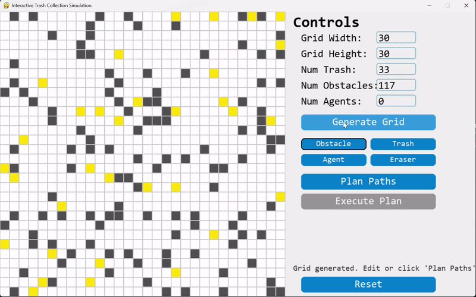

# Multi-Agent Trash Collection (Task Assignment + Conflict-Based Search)

An interactive Pygame simulation where multiple agents collect trash scattered across a grid, without ever colliding with each other or with obstacles.



## What it does

- **Task assignment:** trash items are greedily assigned to agents so that total workload stays roughly balanced across the team.
- **Path planning:** each agent finds its route with the **A\*** algorithm on the grid, avoiding obstacles.
- **Conflict resolution:** a high-level **Conflict-Based Search (CBS)** layer detects when two agents would occupy the same cell at the same time step and re-plans around that constraint, so the whole team moves without collisions.
- **Interactive UI:** build a custom grid (or generate a random one), place agents/obstacles/trash by hand, then plan and replay the execution with adjustable playback speed.

## Run it

Requirements: Python 3.x

```bash
pip install -r requirements.txt
python main.py
```

## Files

- `simulation_core.py` — grid generation, A*, CBS solver, task assignment, simulation model.
- `main.py` — Pygame UI: grid editor, controls, and playback animation.
